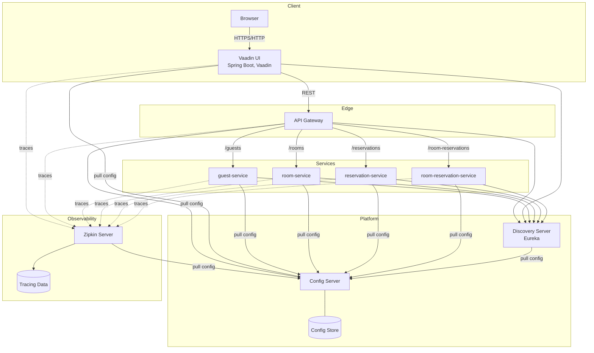

# Software Architecture Cloud-Native Booking Service

A sample cloud-native microservices application built with Spring Boot and Spring Cloud. It demonstrates a modular booking domain composed of independent services, an API gateway, centralized configuration, service discovery, and a Vaadin-based UI.

This repository includes:
- Vaadin web UI
- API Gateway for edge routing and cross-cutting concerns
- Config Server for centralized configuration management
- Discovery Server (Eureka) for service registry and discovery
- Domain services (Guest, Room, Reservation, Room-Reservation composition)

The project showcases common cloud-native patterns: service decomposition, centralized config, service discovery, API gateway, and a UI that consumes the services.

## Repository Structure

- `vaadin-ui/`
- `api-gateway/`
- `config-server/`
- `discovery-server/`
- `guest-service/`
- `room-service/`
- `reservation-service/`
- `room-reservation-service/`
- `etc/` (local development configuration)

## Architecture Diagram

## Key Interactions

- **UI via Gateway**: `vaadin-ui/` calls backend REST endpoints through `api-gateway/` for a single, consistent entry point.
- **Service Registration**: All apps (UI, gateway, services) register with `discovery-server/` (Eureka) to enable dynamic discovery.
- **Centralized Config**: Every app fetches configuration from `config-server/`, which in local development reads files under `etc/`.
- **Composition Endpoints**: `room-reservation-service/` composes data from `room-service/`, `reservation-service/`, and possibly `guest-service/` to provide UI-friendly views.
- **Routing**: `api-gateway/` exposes routes like `/guests`, `/rooms`, `/reservations`, `/room-reservations` and forwards to the respective services.
- **Observability-ready**: With discovery and gateway in place, standard Spring Cloud patterns (health checks, metrics) can be enabled across services.

## Component Descriptions

- **`vaadin-ui/`**
  - Vaadin Flow UI on Spring Boot.
  - Presents booking screens and actions for end-users.
  - Communicates exclusively via the API Gateway.

- **`api-gateway/`**
  - Spring Cloud Gateway for edge routing and cross-cutting concerns (CORS, rate limits, auth proxies, headers).
  - Discovers downstream services via Eureka and forwards traffic accordingly.

- **`config-server/`**
  - Centralized configuration service.
  - In local dev, sources properties/YAML from the `etc/` directory in this repo.

- **`discovery-server/`**
  - Eureka service registry for dynamic discovery and client-side load balancing.

- **`guest-service/`**
  - CRUD for guests (e.g., create/update guest profiles, list/search guests).
  - Exposed through the gateway (e.g., `/guests`).

- **`room-service/`**
  - CRUD for rooms (definitions, attributes, availability support as applicable).
  - Exposed through the gateway (e.g., `/rooms`).

- **`reservation-service/`**
  - Core reservation lifecycle: create, list, cancel.
  - Exposed through the gateway (e.g., `/reservations`).

- **`room-reservation-service/`**
  - Aggregates data across room and reservation (and potentially guest) to simplify UI consumption.
  - Exposed through the gateway (e.g., `/room-reservations`).

## Technology Stack

- **Language/Runtime**: Java, Spring Boot
- **Cloud-Native**: Spring Cloud (Gateway, Config, Eureka/Discovery, Micrometer tracing)
- **UI**: Vaadin Flow
- **Build**: Maven (with Maven Wrapper scripts available)
- **Config**: Centralized via Config Server; local profiles read from `etc/`
- **Packaging/Run**: Spring Boot executable JARs; `spring-boot:run` for dev

## Getting Started (Local)

- **Build** (from repo root):
  - PowerShell: `mvn -q -T 1C -DskipTests clean install`

- **Recommended Startup Order** (each in its own terminal, using the `dev` profile):
  1. `config-server/`
  2. `discovery-server/`
  3. Domain services: `guest-service/`, `room-service/`, `reservation-service/`, `room-reservation-service/`
  4. `api-gateway/`
  5. `vaadin-ui/`
  6. Optional: zipkin docker container: `docker run -d -p 9411:9411 openzipkin/zipkin`

- **Run examples**:
  - `mvn -q -pl config-server -am spring-boot:run -Dspring-boot.run.profiles=dev`
  - `mvn -q -pl discovery-server -am spring-boot:run -Dspring-boot.run.profiles=dev`
  - `mvn -q -pl guest-service -am spring-boot:run -Dspring-boot.run.profiles=dev`
  - `mvn -q -pl room-service -am spring-boot:run -Dspring-boot.run.profiles=dev`
  - `mvn -q -pl reservation-service -am spring-boot:run -Dspring-boot.run.profiles=dev`
  - `mvn -q -pl room-reservation-service -am spring-boot:run -Dspring-boot.run.profiles=dev`
  - `mvn -q -pl api-gateway -am spring-boot:run -Dspring-boot.run.profiles=dev`
  - `mvn -q -pl vaadin-ui -am spring-boot:run -Dspring-boot.run.profiles=dev`
  - `docker run -d -p 9411:9411 openzipkin/zipkin`

- **Useful URLs (examples, may vary by config)**:
  - Eureka Dashboard: `http://localhost:8761/`
  - API Gateway: `http://localhost:8080/`
  - Vaadin UI: `http://localhost:8090/`
  - Zipkin: `http://localhost:9411/`

## License

Educational/demo purposes. Add or adjust licensing details as needed.
